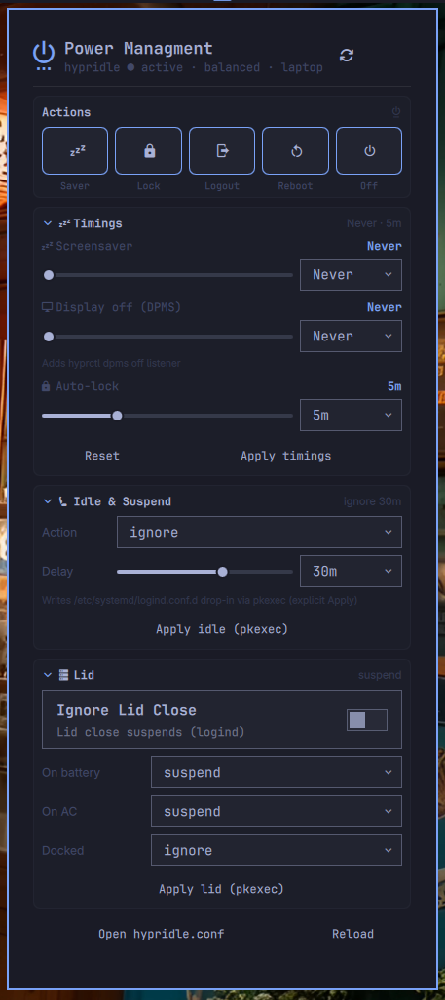

# Power Managment

Centralize Omarchy power & idle options — screensaver, display-off, auto-lock, idle suspend and lid-switch from the Quattro bar.



## Features

- **Timings** — 󰒲 Screensaver, 󰍹 Display off (DPMS), 󰌾 Auto-lock — sliders + dropdown `Never / 1m … 120m`, edits `~/.config/hypr/hypridle.conf` (atomic write, `.bak`), live `hyprctl reload` / `systemctl --user try-restart hypridle`
- **Idle & Suspend** — `IdleAction` (`ignore` / `suspend` / `suspend-then-hibernate` / `hibernate` / `poweroff` / `lock`) + `IdleActionSec` via `/etc/systemd/logind.conf.d/10-omarchy-power-managment.conf` drop-in (explicit `pkexec` on Apply)
- **Lid** — 󰒋 `HandleLidSwitch` (on battery), `HandleLidSwitchExternalPower` (on AC), `HandleLidSwitchDocked` — `ignore / suspend / hibernate / poweroff / lock`; auto-hidden on desktop (`lid-is-present: no` via `upower -d`, `/sys/class/power_supply/BAT*`)
- **Battery-aware** — `On Battery` section hidden on desktop, `isLaptop` detection via `upower` + `sysfs`; `powerprofilesctl get` shown in header (`performance` / `balanced` / `power-saver`)
- **Bar widget** — 󰐦 (or 󰁹 on battery, 󰅺 if hypridle down) + tooltip `saver · lock · lid` — click to toggle panel
- **No PII** — no homelab data, no telemetry, local-only, validates `0–7200s` + enum lid actions

## Installation

```bash
omarchy plugin add https://github.com/tug-benson/omarchy-power-managment --enable
```

Or symlink for development:

```bash
ln -s ~/Work/omarchy-power-managment ~/.config/omarchy/plugins/io.github.tug-benson.power-managment
omarchy-shell shell rescanPlugins
```

Remove:

```bash
omarchy plugin remove io.github.tug-benson.power-managment
```

## Dependencies

Manual via `pacman` — no auto-install:

```bash
sudo pacman -S --needed hypridle hyprlock power-profiles-daemon upower python3 polkit
# hypridle/hyprlock usually already present with Omarchy/Hyprland
```

- `hypridle` + `hyprlock` + `hyprctl` — idle/lock/DPMS
- `systemd` (`systemd-analyze`, `systemd-logind`, `logind.conf.d`) — suspend/lid
- `upower` + `power-profiles-daemon` — laptop/desktop detection
- `python3` — helpers (`bin/omarchy-power-managment-*`)
- `polkit` (`pkexec`) — privileged writes to `/etc/systemd/logind.conf.d`

## Features

- **Actions** — 󰒲 Screensaver, 󰌾 Lock, 󰍃 Logout (confirm), 󰜉 Reboot (confirm), 󰐥 Shutdown (confirm) — 5 icon buttons in panel

## Usage

1. Click 󰥔 in the bar → panel opens.
2. **Timings** — adjust Screensaver / Display off / Lock, then `Apply timings` (writes `hypridle.conf` immediately, no sudo).
3. **Idle & Suspend** — choose `Action` + `Delay`, then `Apply idle (pkexec)` (creates drop-in, `systemctl restart systemd-logind` via polkit).
4. **Lid** — visible only on laptop (`lid-is-present: yes`); set `On battery` / `On AC` / `Docked`, then `Apply lid (pkexec)`. On desktop the section shows `No lid detected — lid settings hidden`.
5. `Open hypridle.conf` → `xdg-open`, `Reload` → re-read configs.

Current defaults match Omarchy stock: `screensaver 1800s` → `omarchy-launch-screensaver`, `lock 2700s` → `omarchy-system-lock`, `display off` disabled, `IdleAction=ignore`.

## Security

- `hypridle.conf` edits are user-owned, atomic (`mkstemp` + `fsync` + `rename`, `0600`, `.bak`) without `sudo`.
- `logind` writes only via explicit `Apply` → `pkexec bash -lc "mkdir -p /etc/systemd/logind.conf.d && cat > … && systemctl restart systemd-logind"` — no hidden `sudo` in polling.
- Validates timings `0` or `30–7200`, lid/idle enums, no `eval`/`bash -c` interpolation, `Process` array form.

## Development

```bash
omarchy plugin validate ~/.config/omarchy/plugins/io.github.tug-benson.power-managment
qmllint -I "$OMARCHY_PATH/shell" ~/.config/omarchy/plugins/io.github.tug-benson.power-managment/*.qml
omarchy-shell shell summon io.github.tug-benson.power-managment '{}'
```

## License

MIT — see `LICENSE`.
